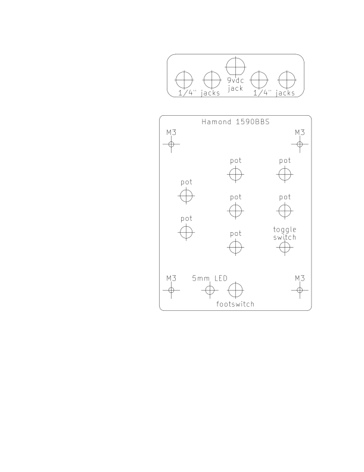

## Printable drill guides

Various file types are provided, they are all the same thing.

I have had the best luck printing to scale by opening up the .gbr file with kicads gerber-viewer and printing from there.

Make sure to measure/compare it to the actual hardware before drilling anything!

