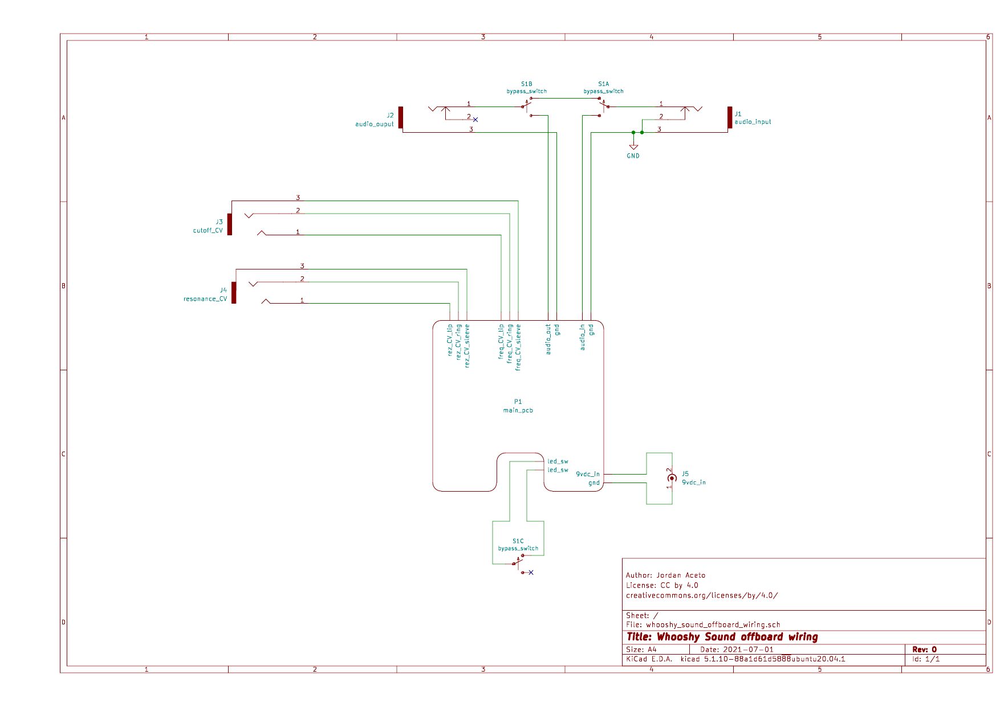

# Offboard wiring

This directory simply contains a wiring diagram for the offboard components that
are wired to the main pcb with flying wires.

These components are:
- signal input and signal output jacks
- 9vdc power input jack
- bypass switch
- cutoff-frequency and resonance CV input/expression pedal jacks
